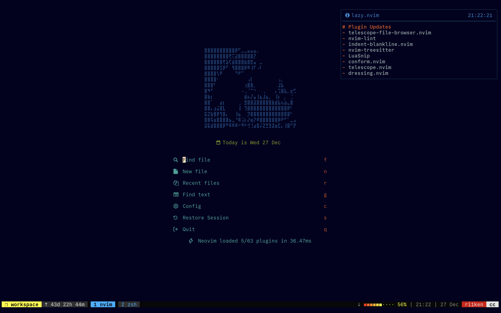

# iok

<p align="center">

<p align="center">🫧 <b>Personal nvim config based on LazyVim</b></p>
</p>

### Install

1. Install [LazyVim](https://www.lazyvim.org/installation).
2. Back up original config files.

```
mv ~/.config/nvim{,.lazy.bak}
```

3. Cover the original folder with **iok**

```
git clone https://github.com/Kiotlin/iok.git path/to/iok
mv path/to/iok ~/.config/nvim
```

4. You're all done. Start by running `nvim`.

### Tips

- Improve key repeat speed

```
# mac os need restart
defaults write NSGlobalDomain KeyRepeat -int 1
defaults write NSGlobalDomain InitialKeyRepeat -int 10

# linux
xset r rate 210 40
```
